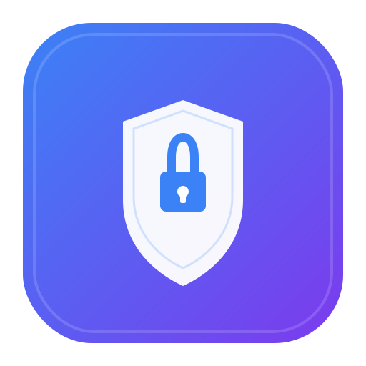

<p align="center">
  
</p>

<h1 align="center">Vault Secure</h1>

<p align="center">
  <strong>Personal Digital Vault</strong> — AES-256-GCM encrypted password manager, crypto wallet keeper, and secure file storage.
</p>

<p align="center">
  <a href="https://github.com/rayane88/vault-secure/releases/latest">
    
  </a>
  
  
  
</p>

---

## 🚀 What is Vault Secure?

**Vault Secure** is a free, open-source, and 100% offline digital vault that stores your most sensitive information with military-grade encryption.

Unlike cloud-based password managers, **your data never leaves your machine**. Everything is encrypted locally using AES-256-GCM and stored in your browser's IndexedDB.

---

## ✨ Features

| Feature | Description | Status |
|---------|-------------|--------|
| 🔑 **Password Manager** | Store and generate strong passwords with an advanced generator | ✅ Ready |
| ₿ **Crypto Wallet Storage** | Securely store addresses, private keys, and seed phrases | ✅ Ready |
| 💳 **Bank Cards** | Store card numbers, expiry dates, and CVV codes | ✅ Ready |
| 📝 **Secure Notes** | Encrypted text notes for anything sensitive | ✅ Ready |
| 🖼️ **Files & Photos** | Store images and documents with preview | ✅ Ready |
| 🌓 **Light/Dark Theme** | Toggle between themes; respects system preference | ✅ Ready |
| 📤 **Export / Import** | JSON backups with optional password encryption | ✅ Ready |
| 📲 **Offline Mode** | Works without internet (Service Worker) | ✅ Ready |
| 🖥️ **Desktop App** | Native Windows app with MSI installer | ✅ Ready |

---

## 🛡️ Security

| Standard | Implementation |
|----------|----------------|
| **Encryption** | AES-256-GCM (military-grade symmetric encryption) |
| **Key Derivation** | PBKDF2 with 100,000 iterations |
| **Salt** | Unique 32-byte cryptographically secure random salt per item |
| **IV** | Unique 12-byte random IV per encryption |
| **Authentication** | GCM Auth Tag for integrity verification |
| **Master Password** | SHA-256 hashed for verification (never stored in plain text) |
| **Storage** | 100% local — IndexedDB inside the Electron app |
| **Network** | Zero network requests; fully offline capable |

> ⚠️ **Warning:** If you lose your master password, your data is **unrecoverable**. There is no backdoor, no password reset, and no cloud sync. Write it down somewhere safe.

---

## 📸 Screenshots

<p align="center">
  <em>Login Screen — Dark Theme</em><br>
  
</p>

<p align="center">
  <em>Dashboard — All Items</em><br>
  
</p>

<p align="center">
  <em>Password Generator — Advanced</em><br>
  
</p>

---

## 📥 Download & Install

### Windows (Recommended)

Download the latest `.msi` installer from the [Releases](https://github.com/rayane88/vault-secure/releases) page and double-click to install.

```
Vault-Secure-v1.0.0-Windows-x64.msi
```

The installer will:
- Install the app to `C:\Program Files\Vault Secure\`
- Create a desktop shortcut
- Add a Start Menu entry
- Register for "Add/Remove Programs"

### Windows (Portable)

Download the `.zip` from the [Releases](https://github.com/rayane88/vault-secure/releases) page, extract anywhere, and run `Vault Secure.exe`.

### macOS & Linux (Build from Source)

```bash
git clone https://github.com/rayane88/vault-secure.git
cd vault-secure
npm install
npm run build
npm run electron
```

---

## 🛠️ Development

### Prerequisites

- [Node.js](https://nodejs.org/) 18 or later
- npm (or pnpm / yarn)

### Setup

```bash
# Clone the repository
git clone https://github.com/rayane88/vault-secure.git
cd vault-secure

# Install dependencies
npm install

# Start development server
npm run dev

# Or start the Electron app in development mode
npm run electron:dev
```

### Build

```bash
# Build the React app for production
npm run build

# Build the Windows MSI installer
npm run dist:win
```

### Project Structure

```
vault-secure/
├── .github/                 # GitHub templates, workflows, funding
├── electron/                # Electron main process & preload
│   ├── main.cjs             # Main process (window, menu, IPC)
│   └── preload.cjs          # Secure bridge between main & renderer
├── public/                  # Static assets (icons, logo, service worker)
├── src/                     # React + TypeScript application
│   ├── components/          # UI components (Login, Dashboard, Forms)
│   ├── hooks/               # Custom React hooks (useTheme)
│   ├── crypto.ts            # Encryption engine (AES-256-GCM)
│   ├── db.ts                # IndexedDB wrapper
│   ├── types.ts             # TypeScript type definitions
│   ├── App.tsx              # Root component
│   └── main.tsx             # Entry point
├── package.json             # Dependencies & scripts
├── vite.config.ts           # Vite build configuration
├── tailwind.config.js       # Tailwind CSS configuration
├── CHANGELOG.md             # Version history
├── CONTRIBUTING.md          # How to contribute
├── SECURITY.md              # Security policy & vulnerability reporting
├── CODE_OF_CONDUCT.md       # Community standards
└── LICENSE                  # MIT License
```

---

## 🛡️ Security Policy

If you discover a security vulnerability, please **do not open a public issue**.

Instead, contact the maintainer directly via GitHub or open a **Security** issue using the [Security template](https://github.com/rayane88/vault-secure/security).

See our full [Security Policy](SECURITY.md) for more details.

---

## 🤝 Contributing

Contributions are welcome! Please read our [Contributing Guide](CONTRIBUTING.md) before submitting a Pull Request.

- 🐛 [Report a Bug](https://github.com/rayane88/vault-secure/issues/new?template=bug_report.yml)
- 💡 [Request a Feature](https://github.com/rayane88/vault-secure/issues/new?template=feature_request.yml)
- 🔒 [Report a Security Issue](https://github.com/rayane88/vault-secure/security)

---

## 📋 Roadmap

- [ ] Double Authentication (TOTP 2FA)
- [ ] Auto-logout after inactivity
- [ ] BIP39 seed phrase generator
- [ ] Password strength audit across all stored passwords
- [ ] Encrypted peer-to-peer sync between devices
- [ ] Mobile app (React Native)
- [ ] Browser extension (Chrome / Firefox)
- [ ] Import from Bitwarden / 1Password / KeePass

---

## 📄 License

This project is licensed under the [MIT License](LICENSE).

```
MIT License

Copyright (c) 2025 rayane88

Permission is hereby granted, free of charge, to any person obtaining a copy
of this software and associated documentation files (the "Software"), to deal
in the Software without restriction, including without limitation the rights
to use, copy, modify, merge, publish, distribute, sublicense, and/or sell
copies of the Software, and to permit persons to whom the Software is
furnished to do so, subject to the following conditions:

The above copyright notice and this permission notice shall be included in all
copies or substantial portions of the Software.

THE SOFTWARE IS PROVIDED "AS IS", WITHOUT WARRANTY OF ANY KIND, EXPRESS OR
IMPLIED, INCLUDING BUT NOT LIMITED TO THE WARRANTIES OF MERCHANTABILITY,
FITNESS FOR A PARTICULAR PURPOSE AND NONINFRINGEMENT.
```

---

<p align="center">
  <sub>Built with ❤️ and 🔒 by <a href="https://github.com/rayane88">@rayane88</a></sub><br>
  <sub>⭐ Star this project if you find it useful!</sub>
</p>
