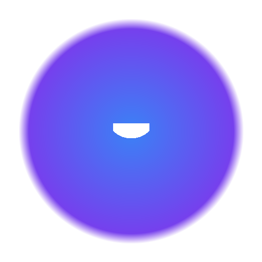

# Vault Secure


> **Coffre-fort numérique personnel** — Stockez vos mots de passe, seed phrases crypto, cartes bancaires, notes et fichiers sensibles avec un chiffrement AES-256-GCM de niveau militaire. 100% offline, rien ne quitte votre machine.

<p align="center">
  
</p>

---

## ✨ Fonctionnalités

| Type | Description |
|------|-------------|
| 🔑 **Mots de passe** | Stockage sécurisé + générateur avancé avec force en temps réel |
| ₿ **Crypto** | Wallets, adresses, clés privées, seed phrases (BIP39 ready) |
| 💳 **Cartes bancaires** | Numéros, dates d'expiration, CVV chiffrés |
| 📝 **Notes secrètes** | Texte libre chiffré |
| 🖼️ **Photos & Fichiers** | Images et documents stockés localement |
| 🌓 **Thème clair/sombre** | S'adapte à votre préférence système |
| 📤 **Export / Import** | Sauvegardes JSON (optionnellement chiffrées) |
| 📲 **Mode hors-ligne** | Fonctionne sans Internet (Service Worker) |

---

## 🛡️ Sécurité

- **AES-256-GCM** — Chiffrement symétrique de niveau militaire
- **PBKDF2** — 100 000 itérations pour dériver la clé depuis le mot de passe maître
- **Salt + IV uniques** — Générés cryptographiquement pour chaque élément
- **Auth Tag GCM** — Vérification d'intégrité de chaque donnée
- **SHA-256** — Hachage du mot de passe maître (vérification)
- **Stockage 100% local** — IndexedDB dans l'app, jamais sur Internet

> ⚠️ **Important** : Ne perdez pas votre mot de passe maître. Il est impossible de récupérer vos données sans lui. Le développeur n'a aucun accès à vos données.

---

## 📸 Captures d'écran

*À ajouter : capture de l'écran de connexion, du tableau de bord et du générateur de mot de passe*

---

## 🚀 Installation

### Windows (MSI recommandé)
1. Téléchargez `Vault-Secure-v1.0.0-Windows-x64.msi`
2. Double-cliquez et suivez l'installation guidée
3. Raccourci automatique sur le bureau et dans le menu Démarrer

### Windows (Portable)
1. Téléchargez `Vault-Secure-v1.0.0-Windows-x64.zip`
2. Extrayez dans un dossier
3. Double-cliquez sur `Vault Secure.exe`

### macOS & Linux ( depuis le code source)
```bash
git clone https://github.com/votre-username/vault-secure.git
cd vault-secure
npm install
npm run build
npm run electron
```

---

## 🛠️ Développement

### Prérequis
- [Node.js](https://nodejs.org/) 18+
- npm ou pnpm

### Installation

```bash
# Cloner
git clone https://github.com/votre-username/vault-secure.git
cd vault-secure

# Dépendances
npm install

# Mode développement (avec hot reload)
npm run dev

# Lancer l'app Electron en mode dev
npm run electron:dev

# Build production
npm run build

# Build l'installeur MSI
npm run dist:win
```

---

## 📁 Structure du projet

```
vault-secure/
├── electron/
│   ├── main.cjs           # Processus principal Electron
│   └── preload.cjs        # Pont sécurisé renderer <-> main
├── public/
│   ├── icon.png             # Icône de l'application
│   └── sw.js                # Service Worker (mode hors-ligne)
├── src/
│   ├── components/
│   │   ├── LoginScreen.tsx  # Écran de connexion
│   │   ├── Dashboard.tsx    # Tableau de bord principal
│   │   ├── ItemForm.tsx     # Formulaire d'ajout d'élément
│   │   └── ExportImport.tsx # Modal export/import JSON
│   ├── hooks/
│   │   └── useTheme.ts      # Gestion du thème clair/sombre
│   ├── crypto.ts            # Moteur de chiffrement AES-256-GCM
│   ├── db.ts                # IndexedDB (stockage local)
│   ├── types.ts             # Types TypeScript
│   ├── App.tsx              # Composant racine
│   └── main.tsx             # Point d'entrée React
├── vite.config.ts
├── tailwind.config.js
└── package.json
```

---

## 🔧 Technologies

- **React 19** + TypeScript
- **Vite** — Build ultra-rapide
- **Tailwind CSS v4** — Styles utilitaires
- **Electron** — Application de bureau multi-plateforme
- **Web Crypto API** — Chiffrement natif du navigateur
- **IndexedDB** — Stockage local persistant
- **Lucide React** — Icônes modernes

---

## ⚠️ Avertissements

1. **Ne perdez pas votre mot de passe maître** — Il est impossible de récupérer vos données sans lui
2. **Videz le cache du navigateur avec prudence** — Cela pourrait effacer vos données (en mode web)
3. **Faites des sauvegardes régulières** — Exportez vos données dans un fichier JSON chiffré
4. **C'est une application locale** — Vos données ne sont jamais envoyées sur Internet

---

## 🤝 Contribution

Les contributions sont les bienvenues ! N'hésitez pas à :

- Ouvrir une **Issue** pour signaler un bug ou proposer une fonctionnalité
- Soumettre une **Pull Request** pour contribuer au code
- Discuter des idées dans l'onglet **Discussions**

### Roadmap

- [ ] Double authentification (TOTP 2FA)
- [ ] Auto-déconnexion après inactivité
- [ ] Génération de seed phrases BIP39
- [ ] Audit de force des mots de passe
- [ ] Synchronisation chiffrée peer-to-peer
- [ ] Version mobile (React Native)

---

## 📄 License

Ce projet est sous licence [MIT](LICENSE).

```
Copyright (c) 2025 Vault Secure

Permission is hereby granted, free of charge, to any person obtaining a copy
of this software and associated documentation files (the "Software"), to deal
in the Software without restriction, including without limitation the rights
to use, copy, modify, merge, publish, distribute, sublicense, and/or sell
copies of the Software, and to permit persons to whom the Software is
furnished to do so, subject to the following conditions:

The above copyright notice and this permission notice shall be included in all
copies or substantial portions of the Software.

THE SOFTWARE IS PROVIDED "AS IS", WITHOUT WARRANTY OF ANY KIND, EXPRESS OR
IMPLIED, INCLUDING BUT NOT LIMITED TO THE WARRANTIES OF MERCHANTABILITY,
FITNESS FOR A PARTICULAR PURPOSE AND NONINFRINGEMENT. IN NO EVENT SHALL THE
AUTHORS OR COPYRIGHT HOLDERS BE LIABLE FOR ANY CLAIM, DAMAGES OR OTHER
LIABILITY, WHETHER IN AN ACTION OF CONTRACT, TORT OR OTHERWISE, ARISING FROM,
OUT OF OR IN CONNECTION WITH THE SOFTWARE OR THE USE OR OTHER DEALINGS IN THE
SOFTWARE.
```

---

<p align="center">
  <b>⭐ Star le projet si vous l'aimez !</b>
</p>
